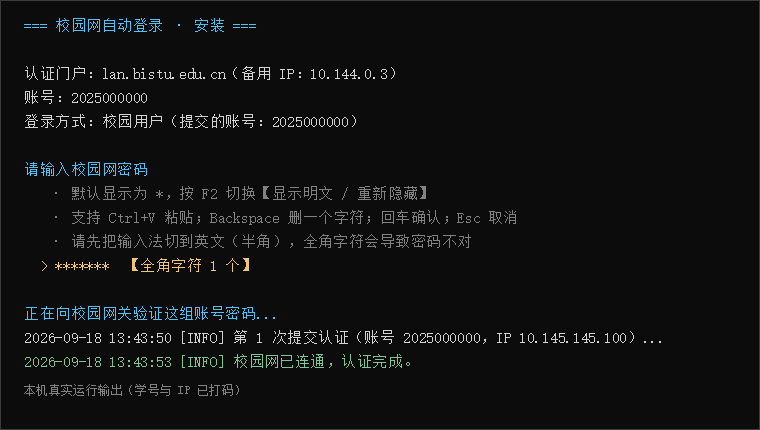
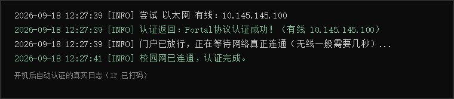
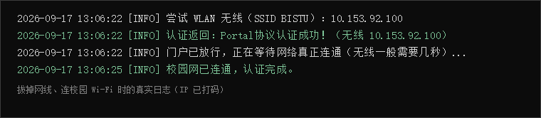
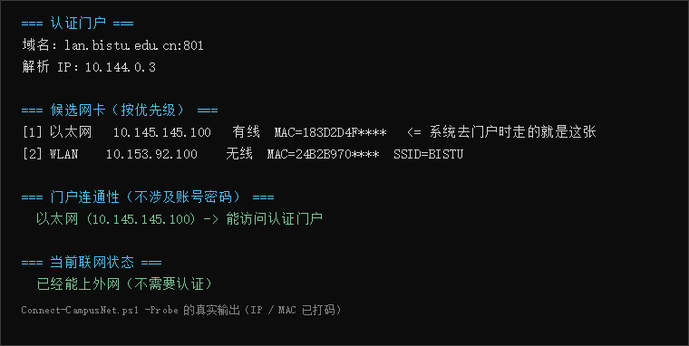

# 校园网自动登录工具（Windows / Dr.COM 门户）

**目前适配：北京信息科技大学**（认证门户 `lan.bistu.edu.cn`，Dr.COM 哆点系统）。

开机登录 Windows 后自动完成校园网认证，不用再打开浏览器、等页面跳转、手动输账号密码。掉线自动重连，有线（以太网）和校园 Wi-Fi（`BISTU`）都能自动识别。

> 纯 PowerShell + VBS 实现，**不需要安装任何东西**，不依赖 Python / Node / .NET SDK。原理是把认证页上"登录按钮"背后的 HTTP 请求直接发出去。

📖 **第一次用、不太懂电脑？看这份手把手的 [使用说明.md](使用说明.md)** —— 从解压到安装、日常使用、常见问题、求助方式都写全了。下面是给熟悉电脑的人看的精简版。

---

## 目录结构

```
.
├─ 使用说明.md                 ← 手把手使用说明书（推荐先看这个）
├─ README.md                   ← 本文件（精简版 + 原理）
├─ LICENSE                     ← MIT
├─ campus-net/                 ← 校园网自动登录（主工具）
│   ├─ install.cmd              双击安装
│   ├─ uninstall.cmd            双击卸载
│   ├─ test-password.cmd        密码"逐字符体检"（查全角字符 / 空格）
│   ├─ Install-CampusNetAutoLogin.ps1
│   ├─ Connect-CampusNet.ps1      核心：检测联网 → 提交认证 → 失败重试
│   ├─ Register-CampusNetTask.ps1 注册计划任务（需管理员）
│   ├─ Uninstall-CampusNetAutoLogin.ps1
│   ├─ Test-CampusNetPassword.ps1
│   ├─ RunHidden.vbs            无窗口启动器（避免闪黑框）
│   └─ QUICKSTART.txt           给"解压就双击"的人的极简说明
│
└─ tools/
    └─ fix-proxy/              ← 配套小工具：浏览器打不开网页的一键修复
        ├─ fix-proxy.cmd
        └─ Fix-Proxy.ps1
```

---

## 快速开始

1. **解压整个文件夹**（不要只拖出单个文件，脚本之间要互相调用）
2. 进入 `campus-net/`，**双击 `install.cmd`**
3. 输入学号 → 登录方式直接回车（默认"校园用户"）
4. 输入密码：
   - 默认显示成一串 `*`，**按 F2 可切换「显示明文 / 重新隐藏」**
   - 支持 **Ctrl+V 粘贴**；输入法请切到英文（半角）
5. 脚本会**当场**拿这组账号密码向门户验证一次，失败会立刻让你重输（最多 4 次），不会带着错密码装上去
6. 弹出 UAC 时点「**是**」（用于注册断线自动重连的计划任务）

装完之后：

- 每次**开机登录 Windows 后约 5 秒**开始自动认证
- 默认还会装一个 **SYSTEM 身份的开机任务**，让"开机到锁屏界面"这段时间也有网（安装时会问你要不要，见下方"安全性"）
- 后台守护进程**监听网络变化**：插网线 / 连上 `BISTU` / 睡眠唤醒 → 几秒内自动重连；另外每 60 秒轻量复查
- 桌面多一个 **「连接校园网」** 快捷方式，可随时手动强制重连（成功 3 秒自动关窗，失败会停住显示原因）

---

## 效果演示

> 下面 5 张图都是**本机真实运行输出**（学号 / IP / MAC 已打码）。

**① 安装时输入密码 —— 默认打码，按 F2 可看明文；打错全角字符会实时报警**



**② 有线：开机登录 Windows 后自动完成认证**



**③ 校园 Wi-Fi（BISTU）：拔掉网线也照常工作**



**④ 网卡体检 `-Probe`：一眼看清走的是有线还是无线、门户通不通**



**⑤ 配套的代理修复工具：一键清掉 Clash 等残留的"死代理"**


---

## 原理

学校用的是 **Dr.COM（哆点）** 认证系统。浏览器打开任意网页会被网关拦截并跳转到认证页，而认证页上的"登录"按钮本质上就是发一次 HTTP 请求。网关按「**IP + MAC**」放行，所以把这个请求直接发出去，效果和手动点登录完全一样，**不需要浏览器**。脚本每次运行都会重新读取当前网卡的 IP 和 MAC，因此换网口、换 IP、DHCP 续约都不影响。

### 有线 / 无线都支持

脚本不写死用哪张网卡，而是用 `Find-NetRoute` 问系统：**要去认证门户时，实际会从哪张网卡、哪个 IP 出去**。连校园 Wi-Fi 时会额外带上 `wlan_user_ssid` 参数（无线口通常必须带），SSID 用 `netsh wlan show interfaces` 读真实值。

> `BISTU-802.1X` 是企业级认证，Windows 连网时自己就完成了，**不需要**这个脚本。

### 门户其实有两个登录服务

| 通道 | 地址 | 说明 |
| --- | --- | --- |
| 新版（默认） | `:801/eportal/portal/login` | 返回 JSON，快。但对 `&` `<` `>` 有过滤器（它先把 `%26` 解码成 `&` 再拦） |
| 老版（自动兜底） | `:80/eportal/?c=ACSetting&a=Login` | 登录页自己声明的地址（`DrcomServer1.0`），**没有这个过滤器**；密码含 `&` `<` `>` 时自动改走它 |

### 密码里的特殊字符（实测）

| 字符 | 结果 |
| --- | --- |
| `!` `#` `$` `%` `'` `(` `)` `*` `+` `,` `-` `.` `/` `:` `;` `=` `?` `@` `[` `]` `^` `_` `` ` `` `{` `|` `}` `~` `"` 空格 `\` | 正常受理 |
| `&` `<` `>` | 新版被拦，自动改走老版通道 |

比特殊字符更容易踩的坑是**全角字符**：中文输入法在全角状态下打出的 `！＠＃`，和半角的 `!@#` 长得几乎一样但码点不同，密码必然不对。双击 `test-password.cmd` 会逐字符列出 U+ 编码，一眼就能看出来。

### 联网判断的坑

**不能用** `generate_204`、`msftncsi`、`captive.apple.com` 这类"联网探测地址"——学校网关把它们放进了 `visit_blacklist`（免重定向名单），未认证时也可能返回正常结果，会让脚本误以为已经在线而不去认证。本项目改用 HTTPS 访问必应/腾讯/百度并校验状态码 + 响应长度。

---

## 安全性

- 密码用 **Windows DPAPI**（`ConvertFrom-SecureString`）加密保存，**只有本机、只有你这个 Windows 用户**能解密；配置文件拷到别的电脑或别的用户都解不开。
- 脚本只向校内网关 `lan.bistu.edu.cn`（80 / 801 端口）发认证请求，**不访问任何第三方服务器，不上传任何数据**。
- **可选的"开机任务"**：为了在"开机后、还没登录 Windows"这段时间也有网，需要把密码**再存一份机器级加密的副本**（`C:\ProgramData\CampusNetAutoLogin\`），交给 SYSTEM 身份的计划任务使用。代价是：**同一台电脑上的其他账户理论上也能解密这份副本**。安装时会询问你是否启用；不启用就只保留用户级那份。
- 启用开机任务时，该目录权限会被收紧为「SYSTEM / 管理员 = 完全控制，普通用户 = 只读」，避免普通账户替换 SYSTEM 要执行的脚本。
- 想彻底删除保存的密码：运行 `uninstall.cmd`。

---

## 常见问题

**开机后没自动登录？**
看日志 `%LOCALAPPDATA%\CampusNetAutoLogin\log.txt`。若写着「没有获取到校园网 IPv4 地址」，说明当时网线还没就绪，下一次定时检查会自动补上；也可以直接双击桌面「连接校园网」。

**提示「用户名或密码错误」？**
先双击 `test-password.cmd` 体检——它会列出每个字符的 U+ 编码，把全角字符和空格标出来（这两样是密码错误头号原因）。确认无误就重新运行 `install.cmd`。

**日志里出现「认证已提交，但联网检测未通过」？**
正常现象。门户返回"认证成功"后，网关（尤其无线口）还要几秒才真正开闸；脚本会持续探测最多约 30 秒再下结论。

**偶尔有黑色窗口闪一下？**
本仓库默认用 `RunHidden.vbs` + `wscript.exe` 无窗口启动，正常不会闪。如果你用的是更早的版本，重新运行一次 `install.cmd` 即可覆盖旧的任务设置。

**认证成功但还是上不了网？**
浏览器打开 `https://lan.bistu.edu.cn` 点「注销」清掉旧会话，然后双击桌面「连接校园网」。

**不想让它每 60 秒检查？**
安装时用：`powershell -ExecutionPolicy Bypass -File Install-CampusNetAutoLogin.ps1 -IntervalMinutes 0`

---

## 配套工具：浏览器代理一键修复（`tools/fix-proxy`）

**典型症状**：浏览器所有网站都打不开、提示「你尚未连接 / 代理服务器可能有问题」（`ERR_PROXY_CONNECTION_FAILED`），但微信、QQ 等软件上网正常。

**原因**：Clash / Clash Verge 等代理工具退出时没关掉"系统代理"，留下 `127.0.0.1:7897` 这类已经没人监听的地址。这个残留会藏在 WinINET 的"局域网连接"运行时配置里——**在"Internet 选项"里看着是关的、注册表里删了也还在**，只有浏览器受影响（因为只有浏览器走 WinINET 这套设置）。

**用法**：双击 `tools/fix-proxy/fix-proxy.cmd`。它通过微软官方 API（`InternetSetOption` + `INTERNET_OPTION_PER_CONNECTION_OPTION`）把局域网连接强制设为「直连」，并清掉注册表残留，然后打印修复前后的状态。

修完记得**把浏览器完全关掉再打开**（浏览器有自己的代理缓存）。顺便一提：以后用完代理工具，**先关掉"系统代理"开关再退出**，就不会再犯。

---

## 适配其他学校

本仓库目前是**北信科专用**，但用的是 Dr.COM 通用协议，代码里只有 4 处写死值，改成你学校的即可：

| 位置 | 变量 | 北信科的值 |
| --- | --- | --- |
| `campus-net/Install-CampusNetAutoLogin.ps1` | `$portalHost` | `lan.bistu.edu.cn` |
| `campus-net/Install-CampusNetAutoLogin.ps1` | `$portalPort` | `801` |
| `campus-net/Test-CampusNetPassword.ps1` | `$PortalHost` / `$PortalPort` / `$LegacyPort` | `lan.bistu.edu.cn` / `801` / `80` |
| `campus-net/Connect-CampusNet.ps1` | 老版接口端口 `$legacyPort = 80` | `80` |

先在浏览器里触发一次认证跳转，看跳转到的门户域名和端口，填进去即可。无线部分不需要改——SSID 是运行时自动读取的。

欢迎提 PR 把你学校的配置加成预设。

---

## 卸载

双击 `campus-net/uninstall.cmd`。会删除：计划任务（含 SYSTEM 开机任务）、启动项、桌面快捷方式、`%LOCALAPPDATA%\CampusNetAutoLogin`（含加密后的密码）以及 `C:\ProgramData\CampusNetAutoLogin`。删除开机任务需要管理员权限，脚本会自动请求一次 UAC。

---

## 免责声明

- 本项目仅用于**在自己电脑上自动完成自己的校园网认证**，请使用**你自己的账号密码**。
- 使用前请自行确认符合所在学校的网络使用管理规定；因使用本工具产生的任何后果由使用者自行承担。
- 作者不对因使用本工具导致的断网、账号异常等任何损失负责。

## 许可证

[MIT](LICENSE)
